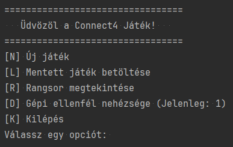

# Connect4-MI alkalmazás dokumentáció
- [Connect4-MI alkalmazás dokumentáció](#connect4-mi-alkalmazás-dokumentáció)
  - [1. Általános bemutató](#1-általános-bemutató)
  - [2. Kódértelmezés (technikai, logikai és szemantikai)](#2-kódértelmezés-technikai-logikai-és-szemantikai)
  - [3. Futtatással kapcsolatos információk](#3-futtatással-kapcsolatos-információk)
  - [4. Tesztesetek](#4-tesztesetek)
  - [5. A projekt története](#5-a-projekt-története)
    - [Kezdeti prompt](#kezdeti-prompt)
    - [Evolúciós prompt napló](#evolúciós-prompt-napló)
  - [6. Újrageneráló master prompt](#6-újrageneráló-master-prompt)
  - [Következtetések](#következtetések)
    - [Végleges konklúzió](#végleges-konklúzió)

## 1. Általános bemutató
A "java-con4-ai" egy klasszikus Connect4 konzolos játék, amely Java 21 LTS környezetre épült. A cél, hogy a játékosok 4 azonos színű korongot helyezzenek el egymás mellett horizontálisan, vertikálisan vagy diagonálisan.

<p style="text-align: center"></p>


Főbb funkciók és jellemzők:
* Játékmódok: Játszható két élő játékos, vagy egy élő játékos és a számítógép ("Sz.Gép") között.
* Mesterséges intelligencia: A gépi ellenfél három nehézségi szinttel rendelkezik (1: kezdő/véletlenszerű, 2: haladó/egy lépést előre számol, 3: profi/két lépést előre számol), amelyet látványos számolási animáció kísér.
* Állapotmentés és betöltés: A játékállás bármikor kimenthető egy `cn4-ment.json` fájlba az "S" vagy a "Mentés" parancs megadásával. A mentés kiterjed a tábla állapotára, a játékosok adataira, a gépi ellenfél nehézségi szintjére, valamint az utolsó lépés vizuális kiemelésének koordinátáira is.
* Győzelmi rangsor: A nyertes mérkőzések adatai egy `cn4-gyoz.csv` fájlban gyűlnek, amiből a főmenüben rangsor generálható.
* Vizuális élmény: A terminálos megjelenítést a `JColor` könyvtár teszi színessé (sárga és piros korongok, győztes vonal fehér hátterű kiemelése, az utolsó lépés ciánkék hátterű jelzése).

## 2. Kódértelmezés (technikai, logikai és szemantikai)
A projekt tiszta, objektumorientált alapelvekre épül, a változók és metódusok a Pascal-case konvenciót követik a könnyű olvashatóság érdekében. A kód minden eleme JavaDoc megjegyzésekkel van ellátva.

* `Main.java`: A belépési pont. Kizárólag a parancssori kapcsolókat értelmezi és átadja a paramétereket a játékmotornak.
* `GameEngine.java`: A központi vezérlő. Tartalmazza a főmenüt, a játékhurkot, a beviteli mezők kezelését, valamint a gépi játékos döntéshozó logikáját és számolási animációját.
* `Board.java`: A játéktér adatmodellje és vizualizációs felelőse. Itt történik a lépések érvényesítése, a győzelmi feltételek ellenőrzése, és a konzolos tábla pontos, elcsúszásmentes kirajzolása a megfelelő színkiemelésekkel.
* `FileManager.java`: Felelős a külső állományokkal való kommunikációért a `Gson` könyvtár segítségével, biztosítva a mentési adatok írását és olvasását.
* `Player.java`: A játékosok tulajdonságait összefogó egyszerű adatmodell.
* `GameTest.java`: A JUnit 5 alapú tesztosztály, amely az üzleti logikát validálja.

## 3. Futtatással kapcsolatos információk
Az alkalmazás a szabványos Maven `pom.xml` segítségével fordítható. A külső függőségek: `SLF4J`, `JColor`, `Gson`, `JUnit 5`.

Elérhető parancssori kapcsolók:
* `-r` vagy `--rank`: A győzelmi rangsor azonnali megjelenítése, majd kilépés.
* `-l` vagy `--load`: Utolsó elmentett állás azonnali betöltése és a játék folytatása.
* `-t [OSZLOPxSOR]` vagy `--table`: Kezdő táblaméret explicit megadása (például `-t 7x6`).
* `-u [NÉV]` vagy `--user`: Az első játékos nevének előzetes definiálása.

Példa indításra: `java -jar java-con4-ai.jar -t 8x8 -u Lajos`

## 4. Tesztesetek
Az alkalmazás stabilitását és üzembiztos működését automatizált egységtesztek (JUnit 5) biztosítják. Az alábbi táblázat összefoglalja a megvalósított teszteseteket és azok célját:

| Vizsgált terület | Teszt neve | Leírás és elvárt működés |
| :--- | :--- | :--- |
| **Játéktér mérete** | `TestBoardSizeLimits` | Ellenőrzi a játéktábla határait. Biztosítja, hogy a minimum 4x4-es és maximum 12x12-es korlátok érvényesüljenek extrém bemenetek (például 2x2 vagy 15x20) esetén is. |
| **Hibás lépés** | `TestInvalidMove` | Azt vizsgálja, hogy a rendszer megakadályozza-e a korong elhelyezését egy már teljesen betelt oszlopban, megőrizve a tábla integritását. |
| **Győzelmi feltétel** | `TestWinCondition` | Validálja a játékszabályokat. Négy azonos színű korong horizontális, vertikális vagy átlós elhelyezkedése esetén a programnak pontosan fel kell ismernie a győzelmet. |
| **Állapotmentés** | `TestFileSaveLoadLogic` | Szimulálja a játékmenet kimentését és visszatöltését. Ellenőrzi, hogy a memóriában lévő adatok hibátlanul íródnak-e ki, és pontosan egyeznek-e a fájlból visszaolvasott állapottal. |

## 5. A projekt története
Azt tudjuk megfigyelni, hogy honnan indultunk, milyen közbenső utasítások, elfogadások és visszavonások folgalmazódtak meg részemről, miközben próbáltam, teszteltem a generált kódot.
### Kezdeti prompt
A projekt kiindulási promptja, ami alapján elindult a fejlesztés. ([ai_prompt.txt](readme/ai_prompt.txt))

```text
Készíts egy konzolos Java alkalmazást az alább felsorolt feltételek szerint.

Megvalósítandó feladat:
A hagyományos Connect4 nevű játék konzolos alkalmazásként való elkészítése teszt esetekkel kiegészítve Java programozási nyelven.

Fordítási és futtatási környezet:
0) A teljes, elkészült alkamazás neve "java-con4-ai" legyen.
1.1) Java 21.0.5 2024-10-15 LTS
1.2) Java Runtime version: 17.0.12+1-b1207.37 amd64
1.3) MavenRunHelper (4.30.0-IJ2022.2)
2) Windows 10 22H2 (19045.7058) 64bit
3) IntelliJ IDEA 2024.1.7 (Community Edition)
4) Felhasználható könyvtárak:
4.1) org.slf4j.LoggerFactory
4.2) org.slf4j.Logger
4.3) ConsoleTable (https://github.com/JohnCSinclair-com/java-console-table)
4.4) JColor (https://github.com/dialex/JColor)

Kód készítés során vedd figyelembe a következő utasításokat:
1) Mindig tiszta, jól konfigurálható, könnyen karbantartható kódot készíts.
1.1) A kódnak egyszerűnek, az emberek számára könnyen követhetőnek kell lennie.
1.2) Egy kezdő programozónak is meg kell tudnia érteni a generált kódot.
1.3) Ha lehetséges, olyan segédfüggvényeket használj, amelyek a kód végrehajtása során bármikor újra felhasználhatók.
1.4) Változók és segédfüggvények esetén az elnevezés mindig leíró jellegű, kifejező legyen, a Pascal-case ajánlásait kövesse.
1.5) Minden lehetséges szinten kövesd a Java nyelvhez tartozó belépési, kilépési és belső használati ajánlásokat. (Getter, Setter, Constructor, stb.)
1.6) Minden lehetséges módon kövesd a Java nyelv ajánlásait az objektum orintáltság megőrzésében, amennyiben lehetséges.
1.7) A program fő részeit szervezd külön-külön fájlokba (tábla rajzolás, állás kimentés, állás visszatöltés, játékmenet, stb.), aminek stuktúrája legyen logikusan felépítve.
1.8) Az alkalmazás legyen parancsori kapcsolók fogadására felkészítve.
1.8.1) Ha az opcionális futási paraméter "-r" vagy "--rank", akkor csak a győztesek rangsorát jelenítse meg csökkenő sorrendben.
1.8.2) Ha az opcionális futási paraméter "-l" vagy "--load", akkor töltse be az előzőleg elmentett játékállást és folytassa.
1.8.3) Ha az opcionális futási paraméter "-t" vagy "--table", akkor tábla méretét állítsa be az ekkor kötelező paraméterként OSZLOPxSOR formában megadott értékűre.
1.8.4) Ha az opcionális futási paraméter "-u" vagy "--user", akkor a kapcsoló után beírt játékos nevét állítsa be az első játékosnak.
1.8.5) Ha bármelyik opcionális paraméter hibásan lett megadva, hibajelzéssel álljon le a futtatás.
2) Minden fontos mozzanatot és eljárást kommentálj.
2.1) Részesítsd előnyben a JavaDoc kommentelést.
2.2) Az egyes mozzanatok magyarázatára használj a Java nyelvi kommentelést.

Játékmenet leírása:
0) Az alkalmazás kövesse a hagyomás játékmenetet.
1) A játék induljon egy üdvözlő képernyővel, ahol lehetőség van gombnyomásra megtekinteni a győzelmek száma alapján számolt rangsort, visszatölteni egy korábban elmenettet játékot, vagy elkezdeni egy teljesen új játékot.
1.1) A rangsor megjelenítésére az "r" vagy "R" karakteket használhatók. A rangsor megállapítása a 'cn4-gyoz.csv' fájlban letárolt adatsorok alapján történjen, csökkenő sorrendben. Ugyanazon nevek minden esetben ugyanazon személyeket jelenti, mert így könnyen megszámlálhatók.
1.2) A kimentett játékmenet visszatöltése "l" vagy "L" karakterekkel történhet. Ebben az esetben ha rendelkezésre áll a 'cn4-ment.json' fájl, akkor folytatódjon a kimentett állástól a játék. Ha nem áll rendelkezésre, akkor egy hibaüzenettel térjen vissza az üdvözlő képernyőre.
1.3) Új játék kezdéséhez az "n" vagy "N" billentyűk lenyomása szükséges.
2) A játékot lehessen 2 élő játékosnak VAGY 1 élő és 1 gépi játékosnak játszania.
2.1) Élő játékosok esetén kérjen be a játékosok számának megfelelő nevet vagy neveket.
2.1.1) Ha két élő játékos azonos nevet ad meg, akkor a nevek egészüljenek ki "-1" majd "-2" sztringekkel.
2.1.2) A gépi játékos elnevezése minden esetben legyen "Sz.Gép".
2.2) Az egyik játékos korongjának színe sárga (S), a másiké piros (P).
2.3) A játék kezdési joga sorsolás útján kerül meghatározásra.
2.4) A tábla méretét (oszlopok és sorok száma) kérje be az első élő játékostól.
2.4.1) Amennyiben nem egész szám a bevitt adat, abban az esetben a tábla mérete minden esetben 6 oszlop és 6 sor.
2.4.2) A játéktér táblája minimum 4 oszlop és 4 sor méretű lehet.
2.4.3) A játéktér táblája maximum 12 oszlop és 12 sor méretű lehet.
2.5) A játéktábla oszlopai az angol ábécé szerint legyenek elnevezve, a sorai arab számozást kapjanak.
2.5.1) A korongokat a rendelkezésre álló oszlopok azonosítójával lehessen leejteni.
2.5.2) Ha olyan oszlop azonosítót ad meg a játékos, ami nem áll rendelkezésre (nem elérhető, betelt), akkor egy hibazenettel jelezzen vissza, s kérjen egy új oszlop azonosítót.
2.6) Minden korong lerakását követően fusson le az ellenőrzés, hogy nyert-e bármelyik játékos.
2.6.1) Amennyiben már nem lehet több korongot elhelyezni, hirdessen döntetlent.
2.7) Minden lépést követően a játéktábla aktualizált állását meg kell jeleníteni.
2.7.0) A játéktér ConsoleTable (https://github.com/JohnCSinclair-com/java-console-table) segítségével legyen ábrázolva.
2.7.1) A lerakott korongokat jelképező betűk színei "S" esetében élénk sárga, "P" esetében élénk piros.
2.7.2) Amennyiben az aktuális kiíratáskor van győztes játékos, a korongokat jelképező betűk (S vagy P) hátterei legyenek fehér színűek, hogy jól kivehető legyen győzelem.
2.7.3) Időbélyeggel egy sorban a győztes nevét, a tábla méretét, a lépések számát, a játékra fordított időt mentsük ki egy UTF-8 kódolású CSV fájlba. A fájl neve legyen 'cn4-gyoz.csv' és a felhasználó könyvtárában létrehozott 'Connect4-MI' könyvtárban legyen elhelyezve.
3) Játék közben bármikor legyen lehetőség az aktuális tábla állását elmenteni "Ctrl+S" billentyű kombinációval.
3.1) A tábla állapotát letároló fájl neve: 'cn4-ment.json' és a felhasználó könyvtárában létrehozott 'Connect4-MI' könyvtárban legyen elhelyezve.
3.1.0) Ha már van egy korábbi 'cn4-ment.json' fájl, akkor kérdezzen rá a felülírásra.
3.1.0) A JSON fájlnak tartalmaznia kell az aktuális tábla méretét (oszlopok száma, sorok száma).
3.1.1) A JSON fájlnak tartalmaznia kell az aktuális tábla állást.
3.1.2) A JSON fájlnak tartalmaznia kell az aktuális játékidőt.
3.1.3) A JSON fájlnak tartalmaznia kell a játékosok neveit.
3.1.4) A JSON fájlnak tartalmaznia kell az utolsó korongot lerakó játékos azonosítóját, ahonnan a másik játékos folytathatja.
4) Az alkalmazás futását bármelyik pillantban be lehet fejezni a "Ctrl+C" billenty kombinációval.

Dokumentáció:
1) Készíts egy magyar nyelvű, részletes alkalamazás dokumentációt Markdown nyelven.
1.1) Legyen egy különálló, általános bemutató megfogalmazva a megvalósítandó és a megvalósult feladatról.
1.2) Legyen külön fejezetben megfogalmazva a technikai, a logikai és szemantikai kód értlemezés.
1.3) Legyen külön fejezetben megfogalmazva a futtatással kapcsolatos információk.
1.4) Legyen egy külön fejezet, ami tárgyalja, hogy pontosan milyen prompt segítségével sikerült a megvalósítani a feladatot.
2) Állíts elő egy parancssorban futtatható, felparaméterezett parancsot, aminek segítségével elő lehet állítani a technikai dokumentációt a Javadoc megjegyzések segítségével.

Tesztesetek készítésekor vedd figyelembe az alábbiakat:
1) Legalább 4 különböző, de akár egymásra is építkező teszt esetet kell készíteni.
1.1) Legyen a játéktér méretével foglalkozó teszt eset. A minimum elvárható méret: 4x4 mező.
1.2) Legyen a játékmenet kimentését és visszatöltését vizsgáló eset.
1.3) Legyen hibás lépést vizsgáló teszt eset.
1.4) Legyen futtatási paramétert vizsgáló teszt eset.
1.x) Bármilyen, az alkalmazás biztonságos futtatására szolgáló további teszt esetet vagy teszt eseteket is megfogalmazhatsz.
```

### Evolúciós prompt napló
Ez már a Geminivel folytatott megvalósítás közbeni párbeszédet mutatja be időrendi sorrendben.
* Készíts egy konzolos Java alkalmazást... [Részletes kezdeti specifikáció: Java 21, Maven, IntelliJ, ConsoleTable, JColor, parancssori argumentumok, 6x6 alapértelmezett tábla, S és P korongok, mentés/betöltés, tesztesetek, dokumentáció].
* Amikor az üdvözlő képernyőn vagyok, nem tudom a futást megszakítani a "Ctrl+C" kombinációval.
* Kérlek, hogy implementáld a "[K] Kilépés" lehetőséget.
* Kérlek, hogy a játék mentéséhez implementáld a "[S] Mentés" karakter értelmezést is.
* A kezdő képernyőn legyen beállítható a gépi játékos erősségi foka 1-3 skálán... A számolás közben a régi, hagyományos pörgő karakter és a "számolás.." felirat legyen látható.
* Igen, kérem a kiegészítést arra vonatkozóan, hogy a mentési JSON fájlba a gépi erősségi szint is megjelenjen.
* Igen, kérem az utolsó lépés vizuális kiemelését.
* Igen, kérem, hogy az utolsó lépés vizuális kiemelésének koordinátái is szerepeljenek a JSON fájlban.
* Kérlek, hogy jelenítsd meg a utolsó, minden módosítást és javítást tartalmazó kódokat.
* Apró megjegyzések: 1) A tábla oszlop elnevezései 1 karakterrel balra el van csúszva... 2) "MENTES [S]" változtasd "Mentés [S]" karakterláncra. 3) A játékos neve melletti betű legyen a jelentésének megfelelő színű. 4) Enter nélküli adatbevitel.
* A "ConsoleTable"-t vegyük ki a specifikációból, mivel nem használjuk. Az Enter nélküli adatbevitel... hagyd figyelmen kívül. Ennek megfelelően kérem a jelenlegi, minden módosítást és javítást tartalmazó kódokat.
* Kérlek, hogy először minden kódot részletesen magyarázz a forráskódokban a JavaDoc ajánlásának megfelelően. Továbbá kérlek, hogy használd fel kiegészítő információként a bementi és a menet közbeni promptokat...
* A readme.md fájl nem részletezi a teszt esetekeket. Kérlek, hogy ezekkel is egészüljön ki. Az evolúciós prompt naplóból távolítsd el az időbélyegeket.

## 6. Újrageneráló master prompt
Az alábbi prompt segítségével várhatóan az egész projekt újra elkészíthetővé válik.

> Készíts egy konzolos Connect4 (4 a sorban) Java alkalmazást az alábbi specifikációk és szigorú kódolási irányelvek alapján.
>
> **Kódolási és formázási elvárások:**
> 1. Java 21 LTS környezet, Maven projektstruktúra (`pom.xml`).
> 2. Használandó külső könyvtárak: `SLF4J` (naplózás), `JColor` (terminál színezés), `Gson` (JSON kezelés), `JUnit 5` (tesztelés). Szigorúan TILOS a `ConsoleTable` vagy egyéb bemenetkezelő könyvtár használata!
> 3. Tiszta, jól konfigurálható objektumorientált kód. A program főbb logikai részeit külön fájlokba szervezd (`Main`, `GameEngine`, `Board`, `Player`, `FileManager`, `GameTest`).
> 4. Alkalmazd a Pascal-case névkonvenciót az összes változó, metódus és osztály esetén.
> 5. Minden osztály, metódus és fontos osztályszintű változó legyen ellátva részletes, magyar nyelvű JavaDoc megjegyzéssel.
>
> **Parancssori argumentumok (`Main.java`):**
> Kezeld a következő opcionális paramétereket:
> - `-r` vagy `--rank`: Csak a győzelmi rangsort jelenítse meg, majd lépjen ki.
> - `-l` vagy `--load`: Töltse be az utolsó mentett játékot és folytassa.
> - `-t [OSZLOPxSOR]` vagy `--table`: Állítsa be a tábla méretét.
> - `-u [NÉV]` vagy `--user`: Állítsa be az első játékos nevét.
> Hibás paraméter esetén a program hibaüzenettel álljon le.
>
> **Főmenü és inicializálás (`GameEngine.java`):**
> 1. Induláskor legyen egy menü: `[N] Új játék`, `[L] Mentett játék betöltése`, `[R] Rangsor megtekintése`, `[D] Gépi ellenfél nehézsége (1-3)`, `[K] Kilépés`.
> 2. A `[K]` parancsra a program `System.exit(0)` utasítással szabályosan álljon le.
> 3. Két játékos van (sárga 'S' és piros 'P'). A második játékos alapértelmezetten a gép ("Sz.Gép"). A kezdés sorsolással dől el.
>
> **Játékmenet és tábla (`Board.java` és `GameEngine.java`):**
> 1. A tábla alapértelmezett mérete 6x6, minimum 4x4, maximum 12x12.
> 2. A tábla fejlécében az angol ábécé betűi szerepeljenek (A, B, C...), a sorok sorszámozottak (1, 2, 3...). A fejléc betűit úgy igazítsd (három szóközzel eltolva), hogy tökéletesen a mezők felett legyenek.
> 3. A játéktér kirajzolásakor a `JColor` segítségével az 'S' karakter legyen élénk sárga, a 'P' élénk piros.
> 4. Lépés bekérésekor a szöveg formátuma ez legyen: `JátékosNeve (SzínesKarakter), válassz oszlopot (A-F), vagy írd be: Mentés [S]:`.
> 5. Ha a felhasználó egy érvényes oszlopbetűt ad meg, a korong essen le. Ha az "S", "MENTES" vagy "MENTÉS" szót írja be, a játékállás mentődjön ki.
> 6. Bármely játékos érvényes lépése után a letett korong háttere a tábla kirajzolásakor legyen ciánkék (utolsó lépés kiemelése). Ha valaki nyer, a nyertes négy korong háttere legyen fehér.
>
> **Gépi ellenfél:**
> 1. A `[D]` menüpontban beállítható szint (1: véletlenszerű lépés, 2: egy lépést előre számol a blokkoláshoz vagy nyeréshez, 3: két lépést előre számol és a középpontot preferálja).
> 2. Amíg a gép gondolkodik, egy külön programszálon jelenjen meg a `Számolás..` felirat és egy pörgő karakter (`\`, `-`, `/`, `|`), ami a számolás végén eltűnik.
>
> **Fájlkezelés (`FileManager.java`):**
> 1. A mentési mappa a felhasználó könyvtárában a `Connect4-MI`.
> 2. Győztes esetén a `cn4-gyoz.csv` fájlba íródjon be: időbélyeg, név, táblaméret, lépésszám, játékidő (másodperc). A `[R]` menü ebből olvassa ki és jelenítse meg csökkenő sorrendben a győzelmeket.
> 3. Mentéskor (`cn4-ment.json` fájlba a `Gson` segítségével) kerüljön bele: oszlopok, sorok, tábla aktuális állása, játékosok nevei, következő játékos indexe, eltelt idő. Kötelezően menteni kell a gépi játékos aktuális intelligenciaszintjét és az utolsó lépés vizuális kiemelésének koordinátáit, amelyeket betöltéskor vissza is kell állítani.
>
> **Tesztek (`GameTest.java`):**
> Készíts JUnit 5 teszteket legalább a következőkre: táblaméret korlátainak ellenőrzése, betelt oszlopba lépés tiltása, győzelem felismerése, valamint a fájlmentés és betöltés logikájának szimulációja.

## Következtetések
A megvalósítás előtt nem gondoltam, hogy ilyen hatékonyan, konkrét kódsor írása nélkül meg lehet valósítani egy összetett projekt feladatot.
* A fenti példa jól mutatja, hogy a `LowCode` vagy `NoCode` valóban ennyire használható megoldást adhat. 
* Ez a megoldás nagyban felgyorsítja a **prototípus** gyártást, ami egy elmélet gyors, de nem feltétlenül precíz megvalósítását adhatja.
* A mesterséges intelligencia -- ebben az esetben [Google Gemini](https://gemini.google.com) -- teljes mértékben értette a magyar nyelven megfogalmazott utasításokat, nem volt szükség korrekcióra. Igaz, a megfogalmazáskor próbáltam figyelni a _egymásra épülésre_, a _következetességre_ és _egyértelműségre._

---
### Végleges konklúzió

A generált kódban és teszt esetekben természetesen lehetnek hibák, nem kezelt problémák, de mint fentebb is írtam, egy elméletet igazoló prototípus gyártásra már-már messzemenően jól teljesíthet.
